# Are You A Kinase Looking For Love?

If yes, this is the right place for you! Our matchmaking agency leverages cutting-edge technology to make sure you find the one that will make your binding pocket melt. Whether you are looking for a lasting binding or a fast thunderbolt, we will find the right fit for you!

We know, dear kinases, how important you are for the proper functioning of living creatures. When you succumb to mutations, we succumb to disease. Of course, with such a busy schedule, it can be hard to find your soulmate. Even worse, many of our clients complain about ligands with commitment. One day their couple looks like a perfect match, then the ligand switches to a similar-looking kinase. 

With us, you will have no more frustrations from nonspecific bindings. To find the perfect candidate, we meticulously go through each detail of structure and chemical properties of ligands. 

Sounds interesting? Let's find out how we do our data-driven magic. 

# What Is A Good Match?

How do you know you are happy with your partner? Does your ligand hug you with the highest possible affinity? Does it shield you from unwanted interactions? In other words, what binding criteria matter to you, our dear kinases?

  <button class="image-button"> What does binding mean to you? </button>
    

      <figure>
        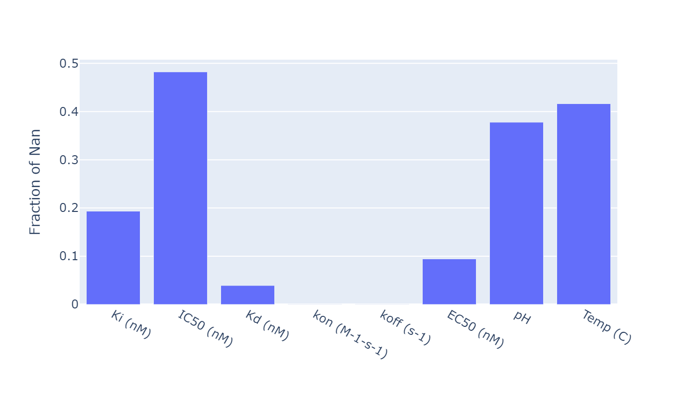
        <figcaption> Counts of Different Binding Metrics </figcaption>
      </figure>
    

Seems like everyone is talking about *IC50* out there! It is the amount of ligand that makes you slow down to exactly a half of your activity. We understand why you prefer this metric – we too would love to find someone to quickly put us in a relaxed mood. There is another metric that shows promise – *Ki*. No wonder it is the case, as *Ki* directly measures the affinity in your couple, what a convenient metric!

Our R&D department found that *IC50* and *Ki* are, in fact, very correlated. So, good news, we can safely rely on either metric to find your match!

<button onclick="togglePlot('kiIc50Plot')" style="padding: 10px 20px; margin: 20px 0; background-color: #4CAF50; color: white; border: none; border-radius: 4px; cursor: pointer;">
  Ki vs IC50 Correlation
</button>

  

    

      <figure style="margin: 0; padding: 0;">
        <iframe src="assets/plots/pKi_pIC50.html" width="300%" height="600px" frameborder="0" style="border: 1px solid #eee;"></iframe>
      </figure>
    

  

Sorry for being a bit intrusive, but how spicy were your previous relationships? Do you like it burning hot, or are you more of a chill partner? We could definitely use the *Temp (C)* of your previous interactions to make good predictions. Also, how emphatic were your relationships? Was the ambiance rather sour, neutral, or basic? You guessed it, we will use the *pH* of your interactions as well.

Great, now that we know everything about your previous romantic endeavors, let's look closer at what matters to you in terms of you partner's chemical characteristics! 

# What Makes A Good Candidate? 
The success in our matchmaking business depends on how accurately we gather information on our candidates. We want our clients to be able to decide whether it is a hit or a miss in a blink of an eye. That is why constructing meaningful profiles is so important. Let's start with the obvious questions – what chemical properties do our clients want in their partners? 

RDKit, a chemical detective agency and our dearest contractor, shared its insights with us.  

## Categorical Features: Functional Group 

  <button class="image-button"> See Functional Groups </button>
    

      <figure>
        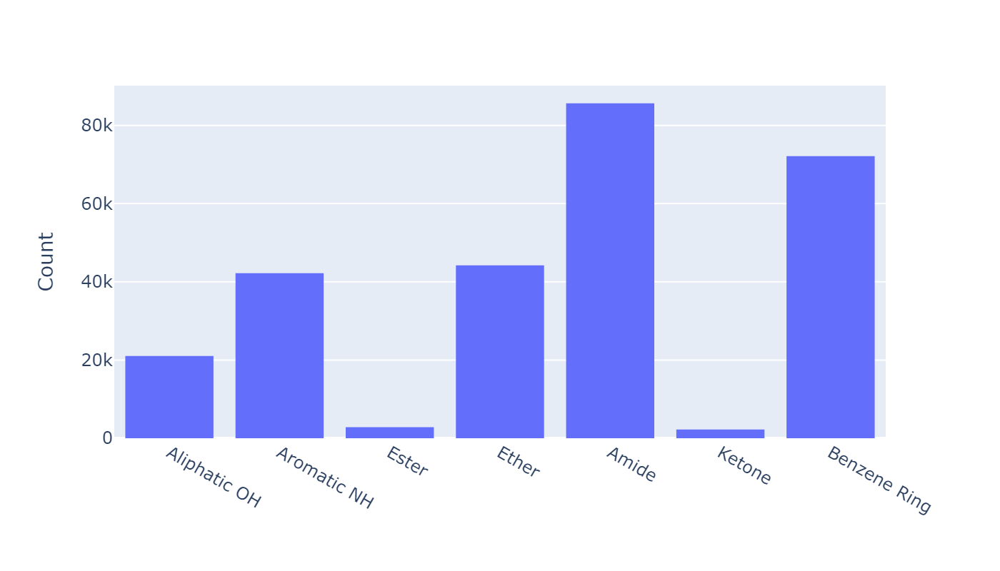
        <figcaption> Functional Groups </figcaption>
      </figure>
  

## Continuous Features 
Now let's consider some continuous features. 

  <button class="image-button"> Chemical Features Distribution </button>
    

      <figure>
        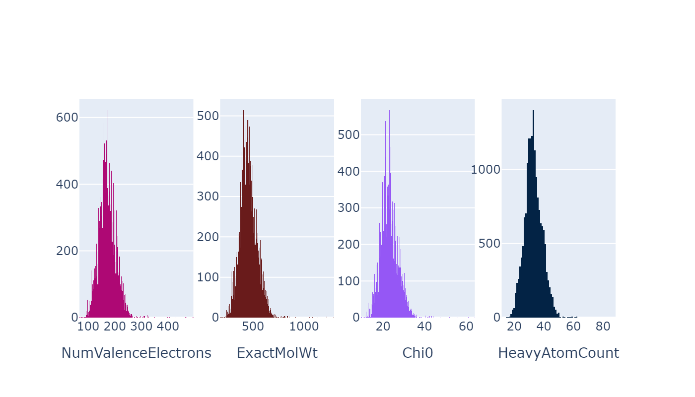
        <figcaption> chemical characterization </figcaption>
      </figure>
  

### Popular matches!
Some of our ligands were popular and were tested for many matches. 45 were involved in more than 25 dates: we can observe that the standard deviation of the success of their matches is pretty different across them.

  <!-- First Plot -->
  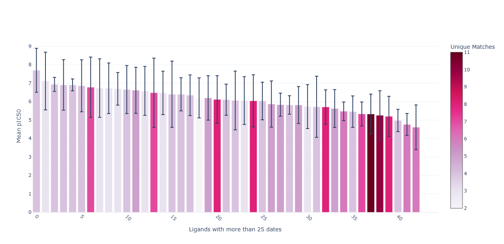

The mutual information between the metrics and the chemical properties is close to zero. This suggests that chemical properties and binding metrics are not related when taken as they are. This motivates the use of embeddings to try to have a more complex representation of the ligands.

  <button class="image-button"> Mutual Info Metric vs Chem Characterization </button>
    

      <figure>
        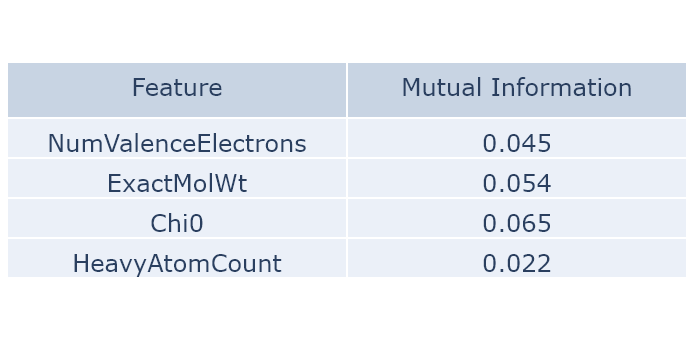
        <figcaption> Mutual Information bewteen metrcs and chemical characterization </figcaption>
      </figure>
  

# A Match Made In Heaven  

## Embedding Space From Rdkit

Well, let's go all-in and look for every available piece of information regarding the chemistry of our candidates! Proud of our partnership with RDKit, an undercover chemical detective agency, we chemically profiled the candidates using all Descriptors provided by RDKit. Of course, nobody would want to go through such extensive profiling for the many candidates in our catalogues – kinases have better things to do – that's why we propose a conveniently rendered summary obtained through dimensionality reduction techniques, so that our clients could quickly skim through the pages of available ligands and skip a heartbeat when seeing _the one_. The UMAP plots below show the embedding space of the ligands based on their RDKit descriptors and colored by their binding metrics in order to see if ligand groups can be clustered by their descriptors and if these clusters are related to the binding metrics.

  

  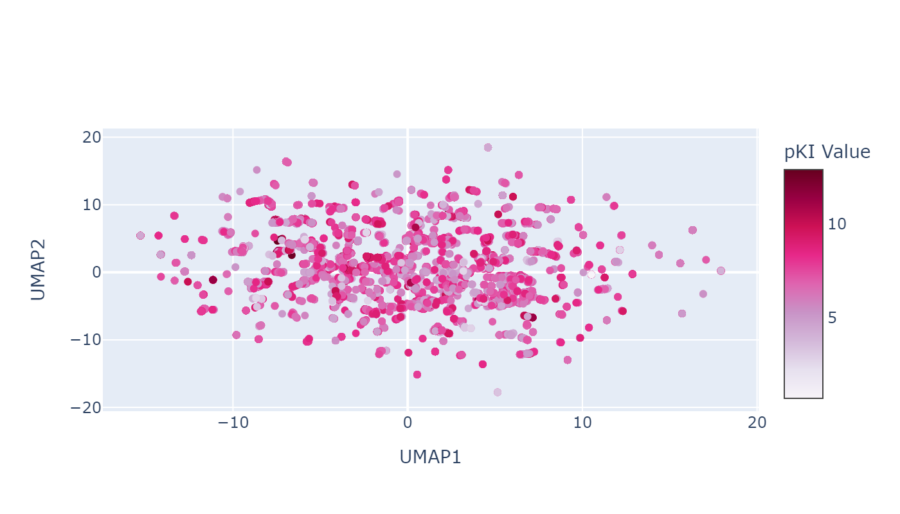

  <button class="image-button"> PCA componants </button>
    

      <figure>
        <iframe src="assets/plots/pca_features_RDKIT_descriptors.html" width="100%" height="400px"></iframe>
        <figcaption> PCA componants </figcaption>
      </figure>
  

  <!-- First Plot -->
  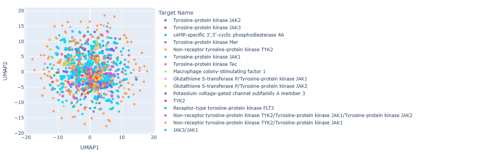
  
<em>RDKIT embedding space color per targets.</em>

Looks like our clients do have their preferences when it comes to binding partners. Maybe we can go even further and uncover some deeply rooted preferences that even kinases do not know about? 

## Mol2Vec embedding space

Inspired by our insightful partnership with RDKit, we contacted our next contractor – Mol2Vec. This agency does the dirty work of finding a meaningful representation of chemical properties and similarities between molecules for you. It considers the ligands for what they, in essence, are – atoms connected by bonds – and constructs vectors that capture everything you need to know. Straight to the point, so that our kinases do not lose their precious time on ligands that weren't meant for them from the beginning. Once again, we care about the comfort of our customers, that's way we propose a dimensionally reduced summary of our findings.

  <!-- First Plot -->
  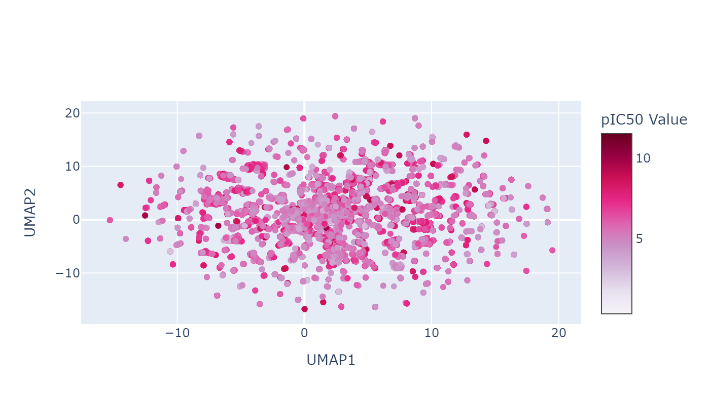
  <!-- Second Plot -->
  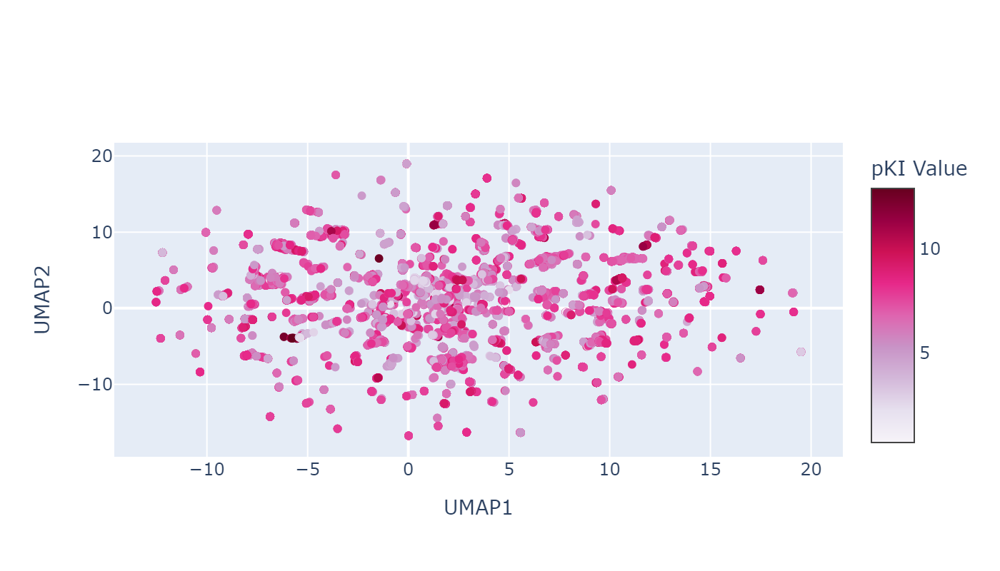

  <button class="image-button"> PCA componants </button>
    

      <figure>
        <iframe src="assets/plots/pca_features_Mol2Vec.html" width="100%" height="400px"></iframe>
        <figcaption> PCA componants </figcaption>
      </figure>
  

  <!-- First Plot -->
  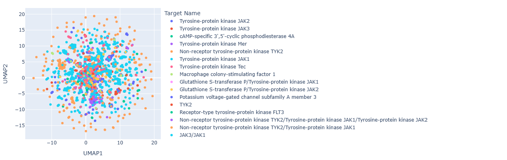
  
<em>Mol2Vec embedding space color per targets</em>

This looks ... convoluted. We contacted Mol2Vec for further explanation but they declined responsibility and accused us of providing ligands that were too structurally similar to be separated. Well, this partnership will not last any longer!

## Morgan Fingerprints Embedding Space 

Luckily, there is no shortage of embedding contractors and Morgan Fingerprints came to save the day. Let's take a look at their insights. 

  <!-- First Plot -->
  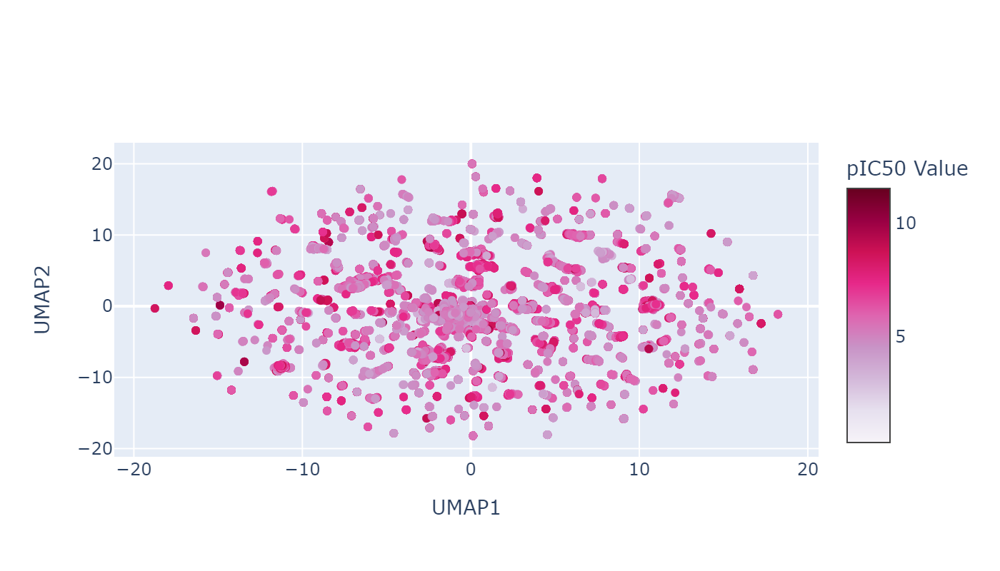
  <!-- Second Plot -->
  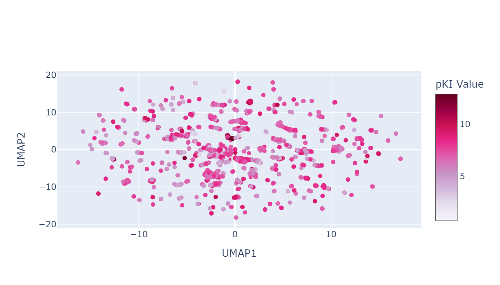

  <button class="image-button"> PCA componants </button>
    

      <figure>
        <iframe src="assets/plots/pca_features_Morgan_Fingerprint.html" width="100%" height="400px"></iframe>
        <figcaption> PCA componants </figcaption>
      </figure>
  

  <!-- First Plot -->
  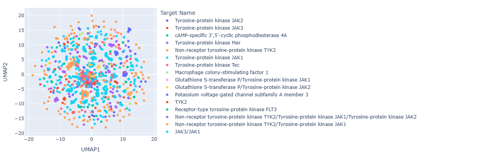
  
<em>Morgan Fingerprint embedding space color per targets</em>

## Full Embedding Space

We have gathered all the embeddings from our contractors and combined them into a single, full embedding space. This way, our clients can have a comprehensive overview of the ligands and quickly find the one that makes their binding pocket tingle.

  <!-- First Plot -->
  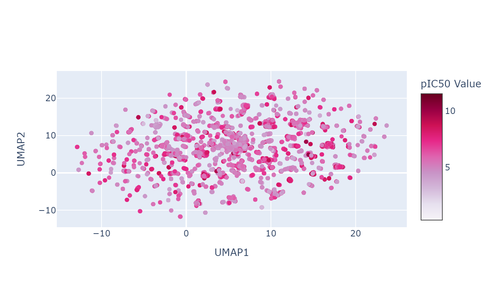
  <!-- Second Plot -->
  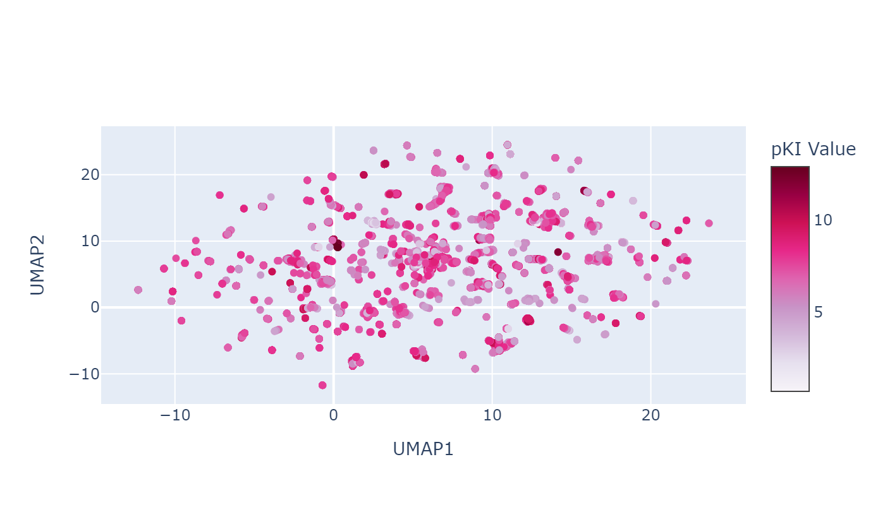

  <button class="image-button"> PCA componants </button>
    

      <figure>
        <iframe src="assets/plots/pca_features_full.html" width="100%" height="400px"></iframe>
        <figcaption> PCA componants </figcaption>
      </figure>
  

  <!-- First Plot -->
  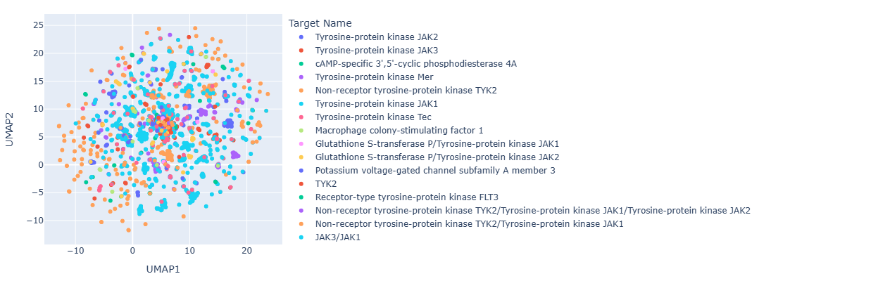
  
<em>Full embedding space color per targets</em>

# Data-Driven Cupid

Here is the latest hit in matchmaking – predicting binding affinities using machine learning approaches. Of course, our R&D department already has some models to test out!

## Multilayer Perceptron

Our economic tier model was a multilayer perceptron that took the concatenated embeddings as input, cheap, reliable and fast. Training with all the new features, from shiny hyperparameter tuning to the latest in data preprocessing, we were ready to make some predictions.
Sadly many of our clients were left disappointed as the model was not able to predict the binding affinities with a satisfying accuracy.

### Graph Neural Network

For our truly speecial clients, we have a special model. Directly inspired by what is considered to be state of the art in terms of ML models in drug discovery, we trained our own graph neural network (GNN) to predict affinities. Each ligand was represented as a graph containing the information about its structure. We added some relevant RDKit Descriptors to the nodes and some bond information to the edges of the graphs. Then we trained a GNN that took in input a graph and was trained to output the pIC50 of the ligand.  Hours of training and tuning later, we were ready to make some predictions.
The model was still not able to predict the binding affinities with a satisfying accuracy. 

Actually both models had a similar performance with a R² that most of our clients would consider as a deal breaker. Proof that even the most advanced models can't replace the human touch in matchmaking.

  <!-- First Plot -->
  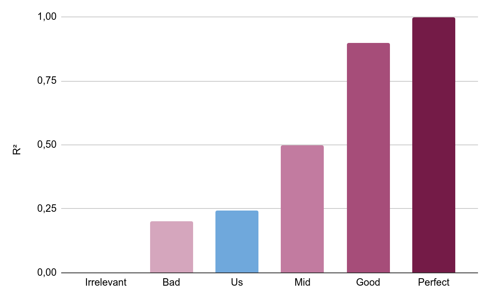

### Closing Words

As it turns out, being a matchmaking agency is no joke. We found our disappointed client listening to _You Should Be Stronger Than Me_ by Amy Winehouse on repeat. As we speak BindingDB is experiencing a severe heartbreak ti is not available anymore, we trust that with our future services and newfound knowledge they will come back strong and ready to find their perfect match !

